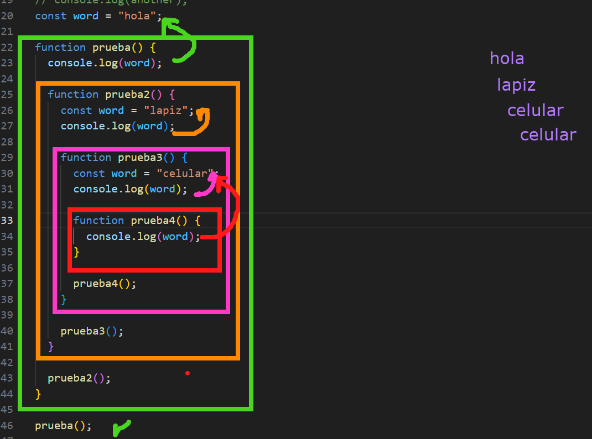

# Conceptos Clave de JavaScript

Este repositorio está dedicado a explorar y entender los conceptos clave de JavaScript. Aquí encontrarás ejemplos y explicaciones diseñados para ayudarte a mejorar tus habilidades en este lenguaje de programación.

¡Esperamos que este repositorio te sea de ayuda en tu aprendizaje de JavaScript!

# Que es un guard clause

Un "guard clause" o "guard statement" es un patrón de programación que se utiliza para manejar condiciones que deben cumplirse antes de que el código continúe ejecutándose. Este enfoque ayuda a mejorar la legibilidad del código y a reducir la anidación de las estructuras de control (como los if anidados).

# Que es recurisividad

La recursividad es un concepto en programación donde una función se llama a sí misma para resolver un problema. Este enfoque se utiliza comúnmente para problemas que pueden dividirse en subproblemas más pequeños y similares al problema original.

# Que es el scope

En JavaScript, el "scope" (alcance) se refiere al contexto en el cual las variables y funciones están disponibles para su uso. Existen dos tipos principales de scope:

Scope global: Variables y funciones declaradas fuera de cualquier función o bloque de código. Están disponibles en cualquier parte del código.

Scope local: Variables y funciones declaradas dentro de una función o bloque de código (usando let o const). Solo están disponibles dentro de esa función o bloque.

Adicionalmente, JavaScript introduce el "block scope" con las declaraciones let y const, lo que significa que las variables declaradas con estas palabras clave solo son accesibles dentro del bloque en el que fueron definidas.

# Que es el event loop

Event Loop
Introducción
¿Recuerdas la lección sobre Call Stack? Cada vez que una función se llama (para ejecutar alguna tarea), esta se agrega al call stack. La función que está "arriba" es la que tiene el control de ejecución en ese momento. Solo cuando una función termina de ejecutarse le puede pasar el control a otra función para que continue su ejecución.

En otras palabras, en JavaScript, solo una función se esta ejecutando a la vez. Quizá hayas escuchado que JavaScript es un lenguaje de programación de un solo hilo (single-threaded). Justamente se refiere a esto. Mientras que la función en "la cima" del call stack se esta ejecutando, el resto de funciones tienen que "esperar su turno".

Pero sabemos que JavaScript puede hacer "en la practica" varias cosas a la vez. El navegador puede estar descargando un archivo, escuchando si el usuario pasa el mouse por encima de un link, reproduciendo un video de una publicidad molestosa, llevando el tiempo de funciones planificadas, etc.

¿Cómo lo logra? A la capacidad de hacer multiples tareas a la vez a pesar de tener un solo hilo de ejecución se le conoce como Concurrencia y en este modelo de concurrencia el Event Loop es una pieza clave. ¡Vamos a verlo!

El Event Loop
Quizá te pueda sorprender, pero resulta que el Motor de JavaScript no es el único componente que usa el navegador para procesar código. Es la parte central, encargado de ejecutar las tareas principales, pero no es la única parte.

Por ejemplo, los métodos setTimeout y setInterval no son parte de la especificación de JavaScript 😮. Estos métodos están disponibles porque el navegador implementa un planificador interno como parte de las Web APIs.

Web APIs
Las Web API con un conjunto de funciones y constructores no definidos por el lenguaje en sí, pero proporcionados por el entorno de ejecución (el navegador). Ejemplos comunes incluyen:

Funciones relacionadas con temporizadores como setTimeout y setInterval.
Llamadas AJAX como XMLHttpRequest o fetch.
Eventos del DOM, como click o mouseover.
Promesas y funciones asíncronas
Cuando se llama a una Web API (como setTimeout), el navegador se encarga de su ejecución, liberando el hilo principal. Una vez que la Web API ha completado su tarea (por ejemplo, después de esperar un tiempo determinado en el caso de setTimeout), agrega el callback a una cola de tareas.

Cola de tareas (Task Queue)
La cola de tareas, también conocida como "message queue", es una lista de funciones (tareas) que están a la espera de ser procesadas.

Si el Call Stack esté vacío y hay tareas en la Cola de Tareas, el Event Loop transfiere la primera tarea en la cola al Call Stack, ejecutando esa tarea.

Funcionamiento del Event Loop
El Event Loop, en esencia, es un bucle infinito que realiza la siguiente operación:

Mira el Call Stack (pila de llamadas) y ejecuta cualquier función que esté allí.
Si el Call Stack está vacío, mira la Cola de Tareas.
Si hay alguna tarea en la Cola de Tareas, traslada la tarea más antigua al Call Stack.
Repite el proceso.
Gracias a este proceso, JavaScript puede ser "no bloqueante". Aunque una tarea pueda llevar mucho tiempo, otras funciones pueden ejecutarse sin esperar a que esa tarea termine.

Resumen
JavaScript es de un solo hilo: Solo una función se ejecuta a la vez en el Call Stack, haciendo que las demás funciones deban esperar su turno.
Concurrencia en JavaScript: A pesar de ser de un solo hilo, JavaScript puede manejar múltiples tareas simultáneamente gracias a su modelo de concurrencia.
Web APIs no son parte de JavaScript: Funciones como setTimeout y setInterval son proporcionadas por el navegador, no por la especificación de JavaScript.
Las Web APIs liberan el hilo principal: Al llamar a una Web API, el navegador maneja su ejecución, permitiendo que el Call Stack continúe procesando otras tareas.
Cola de Tareas (Task Queue): Es una lista de funciones que están esperando ser procesadas. Cuando las Web APIs completan su tarea, colocan la función callback en esta cola.
Funcionamiento del Event Loop:
Verifica el Call Stack y ejecuta funciones.
Si el Call Stack está vacío, revisa la Cola de Tareas.
Transfiere tareas de la Cola de Tareas al Call Stack cuando sea necesario.
